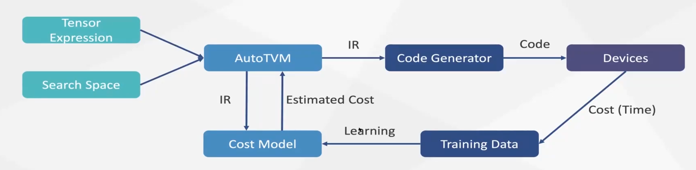
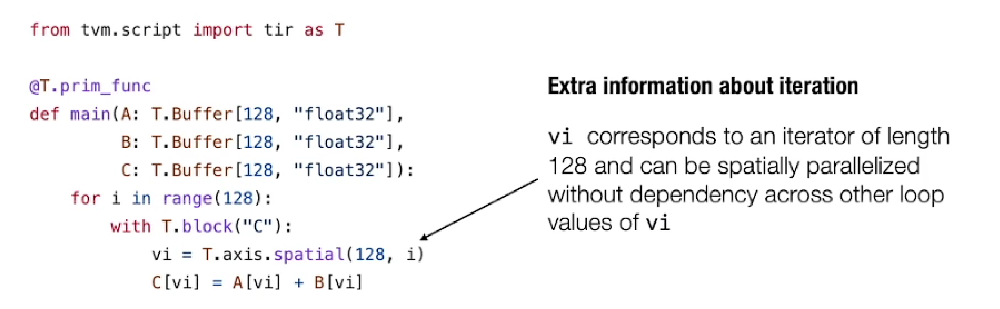
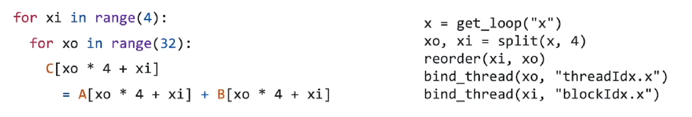
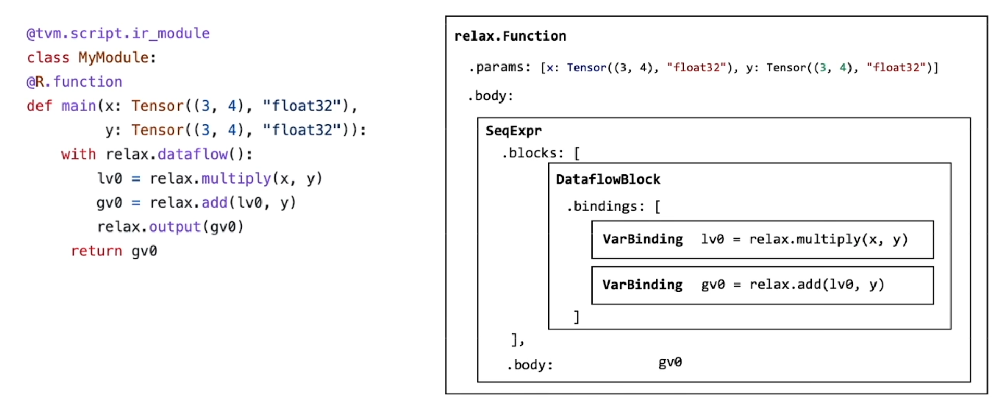

内容来源：
https://csdiy.wiki/%E6%9C%BA%E5%99%A8%E5%AD%A6%E4%B9%A0%E7%B3%BB%E7%BB%9F/MLC/
https://zhuanlan.zhihu.com/p/636393121

## 为什么要做TVM

随着人工智能（AI）的应用在各行各业相继落地，AI算法的推理速度成为了制约实际应用范围和成本的核心因素。近年来，以TVM为首的深度学习编译器，通过针对深度学习计算图和基于Halide调度算法的张量计算的优化，大幅提升了机器学习算法，尤其是深度神经网络的推理速度。

传统深度学习框架：
- 高层IR -> operator -> CUDNN CUBLAS -> GPU
- 问题：库不支持算子，其他硬件不支持，尤其tensorflow不同版本对应不同cudnn版本

TVM：
- 自己生成代码而非调库，通用到有编译器的系统
- 高层IR -> Tensor expression and schedule -> CUDA -> GPU

AutoTVM： learning-based optimization
- 高性能
- 多后端
- 灵活性，高效的新算子适配
- 自动化



计算图优化
- 算子融合，增加计算的局部性
- layout transform： NCHW -> NHWC
  - CPU上 NHWC快
  - GPU上 NCWH快
- 张量优化矩阵乘法
  - 区块化计算tiling、vectorization、循环重组reorder、内存结构优化、cache写回、并行化
  - 通过调度原语应用优化
- tensor expression前端写清算子如何计算
- schedule说明算子如何优化，保证正确性，不同顺序以及不同参数产生巨量搜索空间

现状
- 快速增长的硬件加速器
- 性能和功耗的高要求
- 快速增长的网络和算子
- 短缺的性能专家，汇编上

挑战
- 更好的性能
- 易用的基础框架
- 自动代码生成
- 更多的前后端适配

## MLC

从开发形态到部署形态：集成并最小依赖打包，支持硬件加速
- 减少内存占用
- 改善执行效率
- scaling to 许多异构节点

### 单元算子表示
TensorIR: 
- prim_func原函数
- 多维数组buffer
- 循环
- 额外结构信息block
  - spatial声明iter可以空间并行化
  - reduction归约轴



算子原语schedule:
- split 
- 循环重排
- 绑定
```python
sch = tvm.tir.Schedule(MyModule)
block_Y = sch.get_block("Y")
i,j,k = sch.get_loops(block_Y)
j0.j1 = sch.split(j, factors=[none,4])
sch.reorder(j0,k,j1)
```



build and run
```python
rt_lib = tvm.build(MyModule, target="llvm")
func_mm_relu = rt_lib['mm_relu']
func_mm_relu(a,b,c)
```

TE: Tensor Expression
用一些原语简单表示计算过程，再create_prim_func


### 计算图表示：build End2End model


call_tir 
- 计算图模式：对有向无环图进行变换
- 张量模式：实际执行由框架开内存空间，需要将输出也放入参数中destination passing
- 对二者兼容，不然难以处理计算图的有向无环图

dataflow block
- 标注计算图区域
- 为安全起见，对计算图子区域进行变换

与算子库整合
- 注册runtime函数 tvm.register_func
- dlpack

bind parameter to IRModule

### 单元算子自动优化
领域优化，有许多细节需要确定，而可能的空间很大，通过人工优化profiling能找到一条相对确定的路径优化，但未必最优。

举例：概率式编程，通过随机的程序变换
- sample_perfect_tile

因此
- 产生随机的搜索空间
- 不断采样训练cost model，通过遗传算法对随机决策的改变，最终拿到更好的schedule
- 用更优的transformation替换原来的primitive tensor function，更新端到端的执行

### 构造IRModule
*i unpack解包

- 通过TE表示计算过程
- 利用blockbuilder

### import model from pytorch
TorchFX graphModule（控制流处理不了）

将TorchFX计算图转化成IRModule
- parameter to constant
- node_map ：fx.node to relax.Var
- 拓扑序迭代 将fx图一一映射到对应的节点中

### GPU优化
GPU结构 内存层级
add介绍 引入shared memory
GEMM介绍 相关优化

### 特殊硬件优化
对于block而非单个元素来计算，如Tensor core
- blockize
- tensorization
  - 描述
  - 实现

### 计算图优化 




High-level op fused
- visitor pattern 不断visit 向算子移动
- FMA：将乘加操作融合，检测到是加法算子，满足条件泽替换为FMA
- remove_all_unused：去掉无用计算

dense and add
- 产生新算子，组合很多
- 新建relax函数dense_add

算子 lower to TensorIR
- call_te 返回调用
- emit_te 生成新binding
- fuse_tir
- pass组合

### 总结